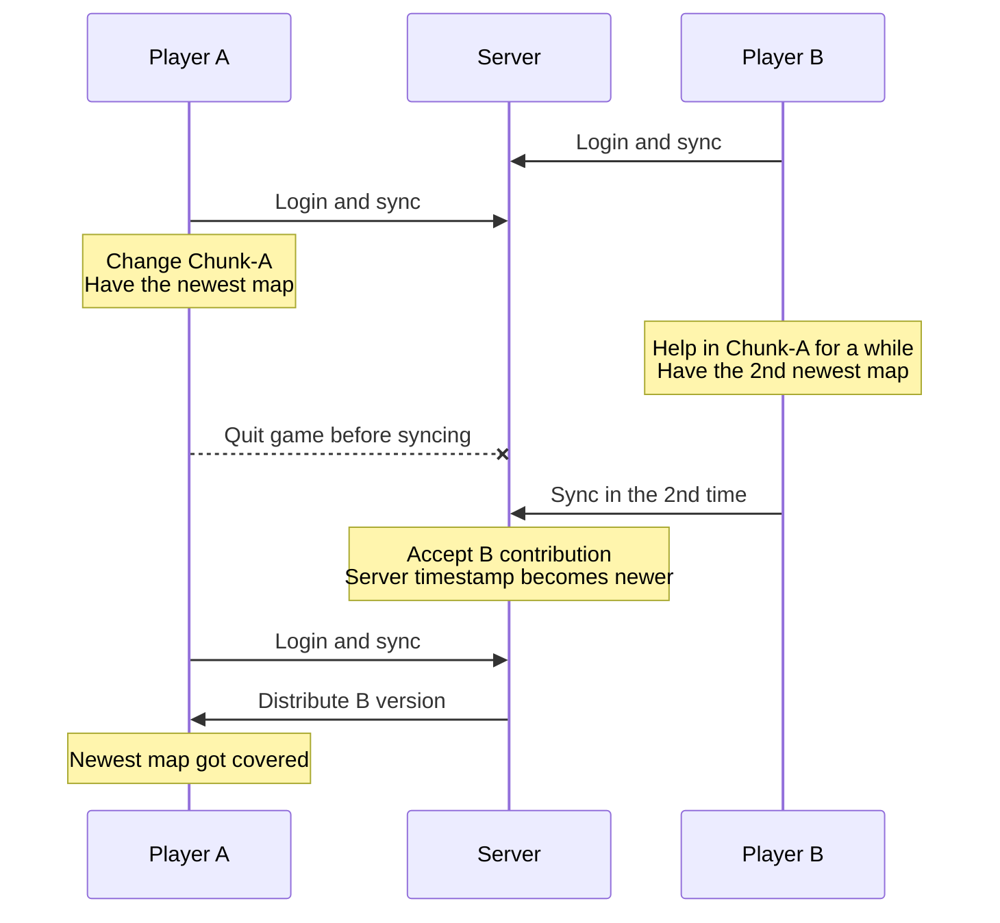

# 退出前贡献同步设计

## 背景

当前双向同步已经具备“先分发、后贡献”的基本路径，并通过队列避免多个玩家同时写服务端缓存。然而地图数据不是单调时间戳能完全描述的对象。两个玩家可能从同一服务端版本分叉，各自拥有不同完整度的 Xaero region；后上传的一方不一定包含先退出玩家的探索结果。

下面的时序是本设计要缓解的问题。A 拥有内容上最新的地图，但 A 先退出；B 后续贡献了次新地图，服务端时间戳因此更新。A 再登录时，如果直接按服务端时间戳分发，A 的本地更完整地图可能被 B 的次新版本覆盖。

## 目标

- 修复客户端元数据判新中的 hash/timestamp 不一致问题。
- 在正常点击退出时，提供一个退出前“仅贡献”同步窗口，尽量把本地地图贡献给服务端。
- 退出前同步不执行服务端到客户端分发，避免离线前反向覆盖本地数据。
- 异常崩溃、杀进程、断网等情况不承诺可靠同步，只保留当前或下次登录的 best-effort 行为。

## 非目标

- 不实现 Xaero region 内部语义合并。
- 不尝试判定 A 与 B 哪个 region 文件内容“更权威”。
- 不拦截所有可能的进程退出路径。
- 不让玩家在等待退出同步期间继续自由活动。

## 方案比较

### 方案 A：仅修复元数据健壮性

客户端生成 `ClientMeta` 时，只有缓存 hash 与当前文件 hash 一致才使用 `sync_timestamps.cache` 中的逻辑时间戳，否则使用文件修改时间。该方案低风险，但不能解决 A 先退出、B 后贡献导致服务端时间戳更新的问题。

### 方案 B：正常退出前仅贡献同步（推荐）

拦截玩家从暂停菜单点击“断开连接/返回标题界面”的动作，先显示一个锁定等待界面。客户端仍保持在线，执行一次专用的“退出前贡献”请求：服务端只根据客户端元数据生成贡献候选，不向客户端分发 region。贡献完成、失败或超时后，再继续原始断开流程。

该方案不能覆盖崩溃退出，但能降低最常见的正常下线丢图概率，并且不会引入 region 合并复杂度。

### 方案 C：region 级语义合并

解析 Xaero region 内容，在服务端合并双方已探索数据，避免整文件覆盖。这是长期最完整方案，但需要理解 Xaero 文件内部语义、处理空白/未知/旧 tile 的合并规则，风险和实现量都较高。本轮不采用。

## 推荐设计

### 元数据判新修复

`ClientHashManager.computeMetaForSync()` 当前只要发现缓存项就直接使用缓存时间戳。修复后应与 `ClientContributionCollector` 保持一致：

- 当前文件 hash 与缓存 hash 一致：使用缓存逻辑时间戳。
- hash 不一致或缓存缺失：使用文件修改时间。

这样可以避免“本地内容变化但仍沿用旧同步时间戳”的误判。

### 退出前贡献流程

新增一个客户端入口 `PreDisconnectContributionManager`，负责启动、跟踪、取消退出前贡献。

流程：

1. 玩家点击退出按钮。
2. Mixin 拦截原始断开动作，不立即断开。
3. 如果客户端模式不是 `BIDIRECTIONAL`、服务端未安装 MapSyncer、已有同步进行中、或不在多人服务器，则直接执行原始断开。
4. 打开 `PreDisconnectSyncScreen`，玩家不能移动或继续操作世界。
5. 客户端扫描本地地图元数据，发送 `ContributionOnlyRequestPayload`。
6. 服务端验证玩家是否允许贡献，并只返回贡献候选。
7. 客户端沿用 `ClientContributionCollector` 上传候选 region。
8. 服务端沿用 `ContributionCoordinator` 串行处理贡献。
9. 收到结果或超时后，界面执行原始断开。

### 玩家状态

等待期间客户端仍连接到服务器，服务端仍认为玩家在线。界面应阻止继续移动、打开背包、发送命令等操作，降低“等待期间又产生新地图数据”的概率。服务器不会暂停，玩家实体仍可能受到环境影响，因此默认超时不应过长。

建议默认超时为 15 秒，可配置 0-60 秒。界面提供：

- `等待同步完成`：默认状态。
- `跳过并退出`：取消贡献并立即断开。
- `取消退出`：关闭等待界面，回到游戏。

### 服务端行为

退出前贡献使用独立请求类型，不触发服务端分发。服务端仍使用现有白名单、OP、队列、冷却和二次基线校验。若队列满或贡献被拒绝，客户端显示简短状态后按超时或用户选择退出。

### 配置项

客户端新增：

- `syncBeforeDisconnect`，默认 `true`：正常点击退出时是否尝试贡献本地地图。
- `disconnectSyncTimeoutSeconds`，默认 `15`，范围 `0-60`：退出前贡献最多等待秒数，0 表示不等待并等同禁用该能力。

配置注释需说明含义，而不仅列出候选值。

### 错误处理

- 服务端无 MapSyncer：直接退出。
- 客户端 `DISABLED` 或 `RECEIVE_ONLY`：直接退出。
- 正在进行普通同步：不启动退出前贡献，提示后直接退出或给玩家取消退出入口。
- 队列满：显示状态并允许跳过退出。
- 网络断开：按原始断开结果结束。
- 崩溃退出：无法保证同步。

## 验收标准

- `ClientHashManager` 不再在 hash 不匹配时复用旧逻辑时间戳。
- 点击暂停菜单断开连接时，符合条件的客户端先进入退出前贡献界面。
- 退出前贡献只上传客户端候选 region，不接收服务端 region 分发。
- 贡献完成、失败、跳过、取消和超时路径都有明确状态。
- 异常退出不承诺同步，文档中明确说明限制。
- 现有普通 `/mapsyncer sync` 行为保持不变。

